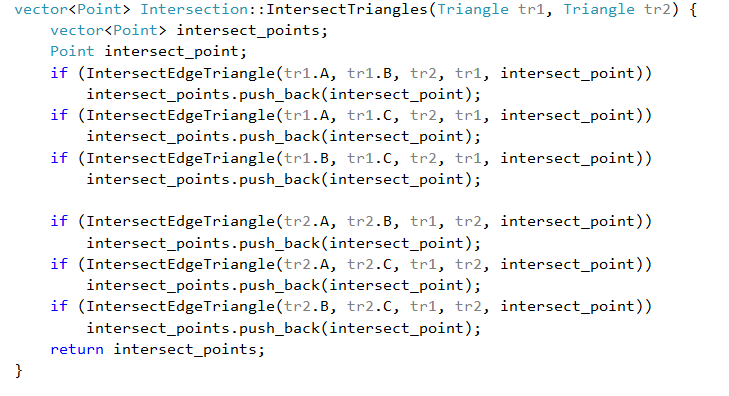
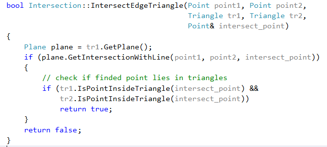
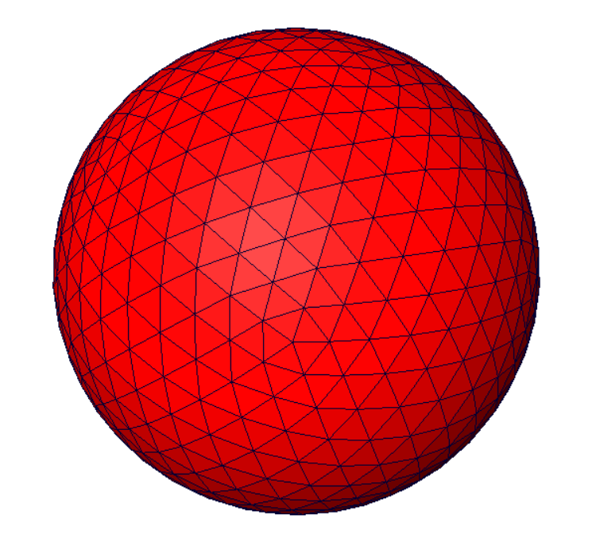
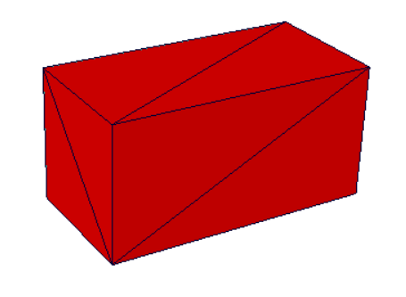
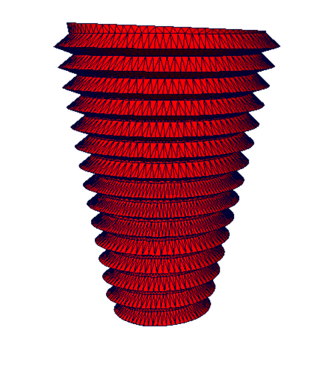
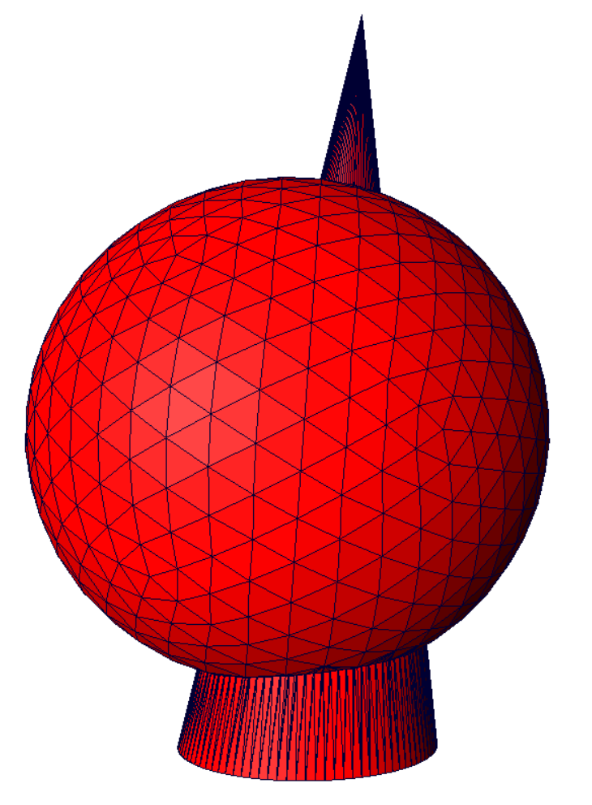
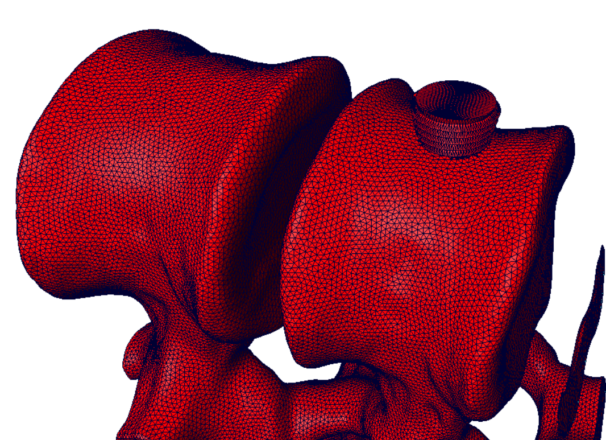
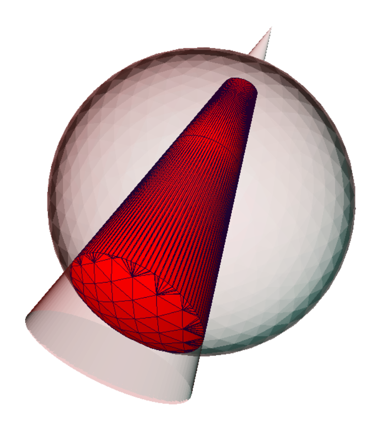
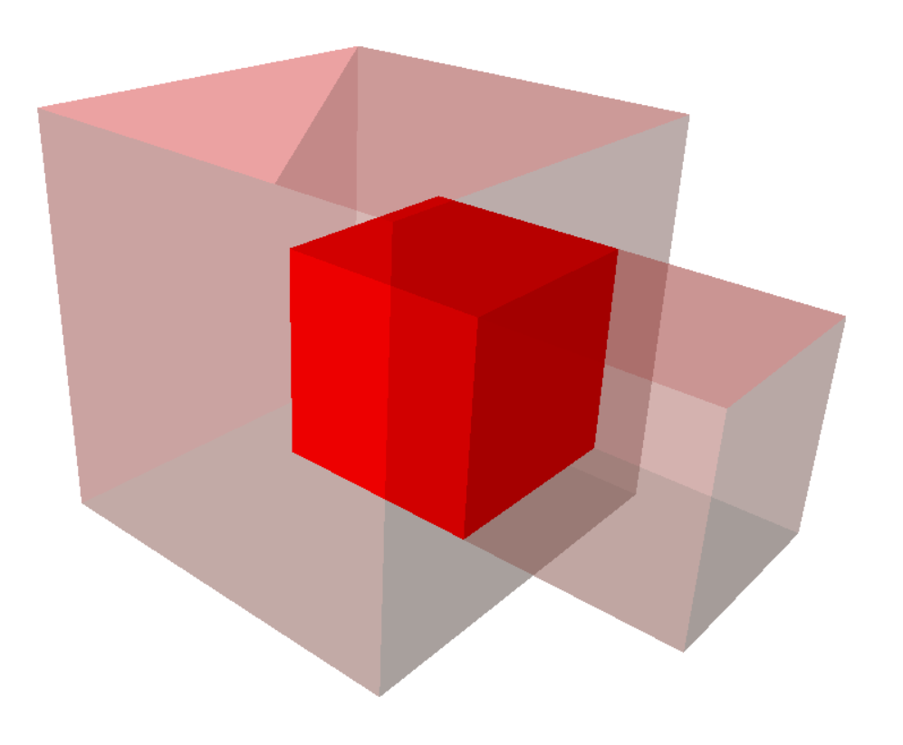

**Министерство образования и науки Российской Федерации**

**Федеральное государственное бюджетное образовательное учреждение **

**высшего образования **

**«Московский государственный технический университет имени Н.Э. Баумана (национальный исследовательский университет)» **

**(МГТУ им. Н.Э. Баумана)**

ФАКУЛЬТЕТ: РОБОТОТЕХНИКА И КОМПЛЕКСНАЯ АВТОМАТИЗАЦИЯ

КАФЕДРА: КОМПЬЮТЕРНЫЕ СИСТЕМЫ АВТОМАТИЗАЦИИ ПРОИЗВОДСТВА

*РАСЧЕТНО-ПОЯСНИТЕЛЬНАЯ ЗАПИСКА*

*К КУРСОВОМУ ПРОЕКТУ НА ТЕМУ:*

***Булевы операции над полигональными моделями***

Студент РК9-72 **\_\_\_\_\_\_\_\_\_\_\_\_\_\_\_\_\_ А.С. Романов**

Консультант **\_\_\_\_\_\_\_\_\_\_\_\_\_\_\_\_\_ С.С. Хрыков **

*Москва 2016*

Аннотация

Темой работы является «Булевы операции над полигональными моделями». Объем курсовой работы страницы. В ней размещены рисунков и таблицы. При написании работы использовалось источников литературы.

Объектом исследования при написании работы послужили полигональные модели. Предметом исследования стали булевы операции над полигональными моделями.

В курсовую работу входят четыре главы. Первая посвящена постановке задачи с учётом технического задания, во второй описываются существующие методы решения данной задачи, а оставшиеся две посвящены разработке, реализации и тестированию.

Во введении абстрактно формулируется постановка задачи, описывается область применения.

Заключение посвящено основным выводам и идеям, о дальнейшем развитии темы, поднятой в данной работе.

**Содержание**

**Введение**

3Д-моделирование прочно вошло в нашу жизнь, частично или полностью перестроив некоторые виды бизнеса. В каждой отрасли, в которую 3D-моделирование принесло свои изменения, имеются как свои определенные стандарты, так и негласные правила.

Можно выделить 3 крупные отрасли, которые сегодня невозможно представить без применения трехмерных моделей. Это:

- Индустрия развлечений

- Медицина (хирургия)

- Промышленность

Будущей областью применения программного продукта, разработанного в процессе данной курсовой работы, является медицина. В частности, для решения актуальных проблем ортопедии все чаще используется

компьютерное моделирование и компьютерная графика. Использование современных информационных технологий снижает риск совершения ошибки при диагностике и планировании операции.

Полигональное моделирование – это вид 3Д-моделирования, в котором вершины задаются тремя координатами, в результате чего получается геометрическая фигура, которая в 3Д-моделировании называется полигоном.  

Полигон с тремя вершинами называется триангулированным полигоном, с четырьмя вершинами – квадриангулированным полигоном. Если посмотреть на модели, созданные с помощью полигонов, то можно заметить, что большинство из них созданы именно полигонами с четырьмя и тремя вершинами. Каждый полигон может иметь собственную текстуру и цвет, а объединив несколько полигонов можно получить модель любого объекта. Соединенные между собой полигоны образуют полигональную сетку или полигональный объект.

Для того, чтобы края модели не имели граненого вида, необходимо, чтобы полигоны были малого размера, а поверхность объекта состояла из маленьких плоскостей.

Полигональное моделирование происходит путем манипуляций с полигонами в пространстве: вытягивание, вращение, перемещение и. т.д. Все эти операции основываются на базовых булевых операциях с полигональными моделями: пересечение, вычитание, объединение.

Результатом объединения двух тел является тело, которое содержит точки, принадлежащие внутреннему объему или первого, или второго тела. Результатом операции пересечения двух тел является тело, которое содержит точки, принадлежащие внутреннему объему как первого, так и второго тела. Результатом операции вычитания двух тел является тело, которое содержит точки, принадлежащие внутреннему объему первого, но не принадлежащие внутреннему объему второго тела.

Целью данного курсового проекта является написание программы для выполнения булевых операций над полигональными моделями.

**Глава 1. Постановка задачи**

**1.1 Техническое задание**

1. Введение

1.1 Краткая характеристика области применения

Программа предназначена к применению в области полигонального моделирования для осуществления булевых операций, пришедших в 3D графику из булевой алгебры и основанных на понятиях объединения, пересечения и вычитания.

2. Назначение разработки

Функциональные назначение программы состоит в предоставлении пользователю возможности выполнения булевых операций над трёхмерными моделями, представленными полигональными сетками.

3. Требования к программе

3.1 Требования к функциональным характеристикам

3.1.1 Требования к составу выполняемых функций

Программа должна обеспечивать возможность выполнения перечисленных ниже функций:

1. функции открытия (загрузки) существующего файла (ов) формата STL

2. функции редактирования открытого файла (выполнение булевых операций) с применением стандартных устройств ввода

3. функции сохранения результата применения булевых операций в виде файла формата STL

3.1.2 Требования к организации входных данных

Входные данные программы должны быть организованы в виде файлов формата STL. Файлы указанного формата должны размещаться (храниться) на локальных или съёмных носителях, отформатированных согласно требованиям операционной системы. Любой файл иного формата открываться не должен.

3.1.3 Требования к организации выходных данных

Выходные данные программы: файл формата STL.

3.1.4 Требования к временным характеристикам

Требования к временным характеристикам программы не предъявляются.

3.2 Требования к надежности

Информационная структура входных файлов должны включать в себя текст, содержащий разметку, предусмотренную спецификацией формата STL.

3.3 Условия эксплуатации

3.3.1 Климатические условия эксплуатации

Климатические условия эксплуатации, при которых должны обеспечиваться заданные характеристики, должны удовлетворять требованиям, предъявляемым к техническим средствам в части условий их эксплуатации.

3.3.2 Требования к составу и параметрам технических средств

В состав технических средств должен входить персональный компьютер, удовлетворяющий следующим требованиям:

• ОС: Windows XP или новее

• процессор Intel Pentium 4 или лучше

• оперативная память: 256 Мб

• жесткий диск: не менее 100Мб свободного места

3.4 Требования к информационной и программной совместимости

3.4.1 Требования к исходным кодам и языкам программирования

Исходные коды программы должны быть реализованы на языке С++. В качестве интегрированной среды разработки программы должна быть использована среда Visual Studio.

3.4.2 Требования к программным средствам, используемым программой

Системные программные средства, используемые программой, должны быть представлены лицензионной версией операционной системы.

3.4.3 Требования к защите информации и программ

Требований к защите информации и программ не предъявляются.

4. Требования к программной документации

4.1 Предварительный состав программной документации

1. Техническое задание

5. Технико-экономические показатели

Программа совместима с операционной системой Windows, а значит доступна большому кругу потребителей. Показывает хорошие показатели быстродействия. На данный момент на рынке не представлено ни одной аналогичной программы российской разработки. Зарубежные аналоги малодоступны и имеют недостатки, которые учитываются при разработке программы.

6. Стадии и этапы разработки

6.1 Стадии разработки

1. Исследование предметной области

2. Реализация выполнения булевых операций с полигональными моделями

6.2 Этапы разработки

1. Подготовка набора тестовых моделей

2. Проектирование и реализация алгоритма полного перебора для поиска линий пересечения моделей

3. Реализация алгоритма триангуляции Делонэ пересекающихся участков моделей

4. Разбиение моделей на внешние и внутренние части с учетом триангулированных поверхностей

5. Реализация операций «Объединение», «Вычитание» и «Пересечение»

6. Тестирование программы с использованием реальных моделей (детали, кости)

**Глава 2. Литературный обзор**

**2.1 Существующие алгоритмы выполнения булевых операций**

Основная проблема булевых операций заключается в том, что результатом некоторой операции даже над двумя простыми выпуклыми многоугольниками в общем случае может являться множество невыпуклых многоугольников с возможными отверстиями и самокасаниями. К сожалению, традиционные алгоритмы ограничиваются тем, что разбивают сложные многоугольники результата на простые, тем самым исключая возможность повторного выполнения операций над результатом. Для задач отсечения по экрану этого достаточно, но в моделировании в целях медицины (имплантаты) требуется реализация замкнутого набора операций над множествами многоугольников. Это означает, что результат, полученный с помощью алгоритма, должен удовлетворять его же предусловию. Также желательно, чтобы алгоритм допускал отверстия и неограниченную кратность вершин. Проведём краткий обзор существующих алгоритмов.

Вейлер (Weiler) и Азертон (Atherton) предложили следующий алгоритм. Ребра исходных многоугольников дублируются, и между ними вычисляются пересечения. Затем производится перераспределение ссылок в вершинах пересекающихся ребер с целью выделения минимальных контуров. Для этого используется довольно сложный набор правил для различных случаев пересечения рёбер. На основе полученных контуров создаются результирующие многоугольники для операций объединения, пересечения и вычитания.

Перечислим основные недостатки этого подхода:

— результат булевой операции не всегда состоит из минимальных контуров;

— не освещена проблема описания многоугольников с самокасаниями, которые могут быть получены в результате работы алгоритма;

— результат операции может не удовлетворять требованиям на входные данные, причем расширение алгоритма для обработки кратных пересечений крайне затруднительно.

Шутте (Schutte) модифицировал алгоритм Вейлера более четким разделением этапов и новым алгоритмом маркировки ребер (edge labeling), однако его алгоритм обладает более существенными ограничениями на входные данные. Итак, приведенные выше алгоритмы реализуют набор операций, не являющийся замкнутым, так как в результате их выполнения могут получаться контуры с самокасаниями, что неприемлемо в качестве исходных данных для обоих алгоритмов, и с отверстиями, которые не допускаются алгоритмом Шутте. Сравнительно недавно Гютинг (Gueting) и Шнайдер (Schneider) разработали ROSE-алгебру (RObust Spatial Extension algebra), реализующую замкнутый набор операций над двумерными объектами, в том числе регионами (regions). Предложенное ими описание также имеет ряд недостатков:

— координаты вершин ROSE-объектов принадлежат дискретному множеству, в отличие от общепринятой в вычислительной геометрии модели вещественнозначной РАМ ;

— сложный и громоздкий в реализации алгоритм связывания сегментов (half-segments) региона в корректные внешние и внутренние циклы (R-cycles), приводящий к снижению эффективности процедур обработки регионов.

В результате анализа существующих решений задачи реализации булевых операций над полигональными моделями в виду явных недостатков каждого из них было решено разделить задачу на более мелкие, и отдельно подбирать алгоритмы для решения каждой подзадачи. Подзадачи были выделены таким образом:

1. Проектирование и реализация алгоритма для поиска линий пересечения моделей

2. Реализация алгоритма триангуляции пересекающихся участков моделей

4. Разбиение моделей на внешние и внутренние части с учетом триангулированных поверхностей

5. Реализация операций «Объединение», «Вычитание» и «Пересечение»

**2.2 Алгоритмы пересечения и структуры данных**

Естественный подход, который заключается в тестировании примитивов одной модели на пересечение со всеми примитивами другой требует огромное количество тестов на пересечение (triangle-to-triangle). Т. о. многие алгоритмы были разработаны с целью уменьшить количество операций за счет использования иерархических структур данных. Все эти структуры данных значительно уменьшают количество тестов пересечений, однако на нижних уровнях иерархии такие тесты все равно должны выполняться.

Т.н. метод «грубой силы» или полного перебора для определения пересечения двух треугольников в трехмерном пространстве требует решения шести линейных уравнений, каждое из которых соответствует пересечению одного ребра треугольника с поверхностью другого. Были предложены более быстрые алгоритмы, которые находят линию пересечения двух треугольников. Мёллер (1998) предложил алгоритм, который основывается на скалярных проекциях вершин треугольников на эту линию. Хельд (1997) использовал метод, по которому сначала вычисляется линейный сегмент пересечения одного треугольника с этой линией, а затем этот сегмент проверяется на пересечение с ребрами другого треугольника. Оба метода в дальнейшем были усовершенствованы, чтобы получить более быстрые и надежные варианты решения задачи поиска пересечения. Один из алгоритмов, который являлся улучшением алгоритма Мёллера, был предложен Гигом и Девиллером (2004). Их метод опирается исключительно на вычисление ориентационных предикатов (определители 4х4) и не требует никаких вспомогательных конструкций.

Все перечисленные методы основаны на геометрическом решении задачи пересечения. Тропп и Шимшони (2005) предложили подойти к проблеме с точки зрения алгебры. Их метод основан на алгоритме полного перебора. Найдя связь в системах уравнений, они сильно упростили решение систем.

Для сложных объектов более эффективен подход, в основу которого положено постепенное продвижение к оболочке, внутри которой находится объект, путем усложняющегося разбиения окружающего пространства на простые ограничивающие объемы (чаще всего - параллелепипеды).

При этом проверка на пересечение простых многогранников, по-прежнему, производится «в лоб», то есть прямым перебором пар, но тотальная проверка пересечений сеток, описывающих объекты, заменяется на проверку пересечений ограничивающих объемов. Лишь на завершающих фазах (когда грани некоторых ограничивающих объемов близки к участкам возможного пересечения) осуществляется тотальная проверка пересечения только таких «вычисленных» участков сеток. В итоге, общее число проверок удается понизить благодаря использованию относительно небольшого числа простых по форме ограничивающих объемов.

Эффективность алгоритмов проверки столкновений, основанных на последовательном разбиении пространства, зависит от многих факторов: способа и порядка декомпозиции пространства, формы и ориентации ограничивающих объемов, формы самого объекта, способа оптимизации разбиения и т.д. Существует много подходов к повышению эффективности этих алгоритмов. Большинство из них сводится к поиску такого способа декомпозиции, при котором сильнее всего уменьшается число пар объектов или примитивов, которые нужно проверять на пересечение.

Октантные деревья, k-мерные и BSP-деревья (бинарные), тетраэдральные сетки, регулярные решетки - все это примеры различных механизмов декомпозиции пространства.

Разделяя пространство, занимаемое объектами, можно проверять контакт только между теми объектами или их частями, которые находятся внутри или около полученного в результате такого деления элемента пространства, что обеспечивает ускорение процесса проверки пересечений.

Конструируя иерархии объектов, можно добиваться аппроксимации объектов с возрастающей точностью, до тех пор, пока не будет достигнута их истинная геометрическая форма. В качестве аппроксимирующих пространств можно использовать сферы, диски, ориентированные вдоль осей координат параллелепипеды (axis - aligned bounding boxes - ААВВ), произвольно ориентированные параллелепипеды (oriented bounding boxes - OBB), дискретно-ориентированные многогранники с количеством k ограничивающих плоскостей (к-dop) (discrete orientation polytopes). Для того чтобы представить эти пространственные структуры, аппроксимирующие объекты, приведем их двумерные изображения (рис. 1).

 

а) б) в) г)

Рис.1. Аппроксимация объекта с помощью четырех пространственных структур: AABB(а); сферы(б); OBB(в); k-dop(k=8)(г)

В виду ограниченного времени на написание данной программы, но с желанием полной работоспособности, было решено оставить введение какой-либо иерархии данных и использование сложных алгоритмов на последующую разработку.

**Глава 3. Разработка алгоритма**

**3.1 Поиск линий пересечения двух моделей**

Поиск пересечения двух полигональных моделей было решено выполнить полным перебором (все полигоны одной модели тестируются на пересечение с другой) в виду простоты и универсальности данного метода. Алгоритм поиска пересечения представлен на блок-схеме (рис. 2).

Рис 2. Блок-схема алгоритма поиска пересечения

Поиск пересечения одного треугольника с другим осуществляется путем поиска пересечения ребер одного треугольника с плоскостью другого. Когда пересечение ребра с плоскостью найдено, надо проверить, лежит ли точка пересечения внутри треугольника. Для этого воспользуемся формулой Герона для поиска площади треугольника и соображением о том, что сумма площадей треугольников, образованных точкой D (рис. 3) и вершинами A, B, C равна площади треугольника ABC (SABC=S1+S2+S3). Если это не так, то точка D не лежит внутри треугольника.

Рис.3

Чтобы увеличить производительность алгоритма поиска пересечения, изначально треугольники проверяются на возможность пересечения по условию из метода Мёллера.

Пусть есть два треугольника T1 и T2 с вершинами V01 , V11 , V21 и V02 , V12 , V22 (заданы векторами) соответственно и плоскости, в которых лежат треугольники π1 и π2.

Уравнение плоскости π2: N2∙X+d2=0(где X - любая точка на плоскости, N2- нормаль плоскости π2) вычисляется:

Подставив вершины в уравнение плоскости, вычисляются расстояния (с учетом знака) от вершин треугольника T1 до плоскости π2:

Если все расстояния не равны нулю и имеют одинаковый знак, то треугольник T1 лежит по одну сторону от плоскости π2, и пересечение отклоняется. То же самое делается для треугольника T2 и плоскости π1. Два ранних теста позволяют отсечь множество пар треугольников от анализа на пересечение.

**3.2 Разбиение моделей на внешние и внутренние части**

Следующим этапом разработки после поиска пересечения идет триангуляция. В данном проекте была выбрана триангуляция Делоне, о которой подробно рассказано в другой пояснительной записке.

Разбиение моделей производится по такой логике: ищется нормаль треугольника одной модели и считается, сколько раз она пересечет другую модель по одну сторону от этого треугольника. Если число четное, то треугольник находится снаружи и не является частью пересечения, если нечетное – внутри и является частью пересечения. Данный этап является самым затратным в плане времени, т.к. приходится искать пересечение всех треугольников одной модели со всеми треугольниками другой модели. В пересечении такое исключается предварительной проверкой. Данный алгоритм впоследствии можно оптимизировать путем добавления структур данных.

**3.3 UML-диаграммы классов и компонентов**

**3.4 Основные блоки программы**

В данном пункте приведены основные части кода программы.

В функции на рис. 4 происходит считывание моделей из файлов и выбор операции, которую надо выполнить.

Рис. 4 Функция main

Выбираем операцию Add (Объединение). На рис. 5 видим последовательность выполнения операции.

Рис. 5 Код операции объединения

Наиболее интересными представляются функции поиска пересечения моделей (IntersectModels), триангуляции (buildInterSectionArea) и разделения моделей (DivideModels). Т.к. триангуляция не была частью задачи данного курсового проекта, а функция разделения, в основном, дублирует функцию поиска пересечения моделей с добавлением большого числа низкоуровневых функций, рассмотрим подробно функцию поиска пересечения, представленную на рис. 6.

Рис 6. Функция поиска пересечения моделей

На данном рисунке можно видеть реализацию алгоритма, представленного на блок-схеме (рис. 2), с добавлением функции UnitePolygons. Эта функция объединяет полигоны с одинаковым индексом треугольников, удаляет одинаковые точки пересечения.

Функция IntersectTriangles выполняет поиск пересечения между двумя треугольниками (рис. 7). Как и говорилось ранее, проверяется пересечение каждого ребра одного треугольника с плоскостью другого, соответственно, всего шесть операций. Функция пересечения ребра с треугольником представлена на рис. 8.

Рис. 7 Функция поиска пересечения треугольников

Рис. 8 Функция поиска пересечения ребра одного треугольника с другим треугольником

Функция IsPointInsideTriangle проверяет принадлежность найденной точки пересечения к треугольнику. Как это происходит, обсуждалось ранее.

**Глава 4. Тестирование**

**4.1 Объединение**

В данной главе рассмотрим результаты работы написанной программы на примере исходных моделей: кубы, сферы.

Рис 4. Два шара разных размеров

Рис 5. Два куба под углом

Рис. 6 Результат объединения двух сфер

Рис. 7 Результат объединения двух кубов

**4.2 Пересечение**

Рис. 8 Результат пересечения двух сфер

Рис. 9 Результат пересечения двух кубов

**4.3 Вычитание**

Рис. 10 Результат вычитания из одной сферы другой

Рис. 11 Результат вычитания из одного куба другого

**Заключение**

Написанная программа успешно выполнила булевы операции над всеми тестируемыми моделями. Все требования технического задания к программному продукту также были выполнены. Задача курсовой работы была достигнута.

В дальнейшем планируется развитие программного продукта в сторону его быстродействия. Для этого надо вводить структуры данных, изменять алгоритмы отдельных этапов программы.

Примечание: при написании программы не было использовано ни одной сторонней библиотеки, связанной с этой областью разработки, от других разработчиков, что повышает эффективность дальнейшей работы в плане понимания возможных ошибок и недостатков программы.

**Литература**
